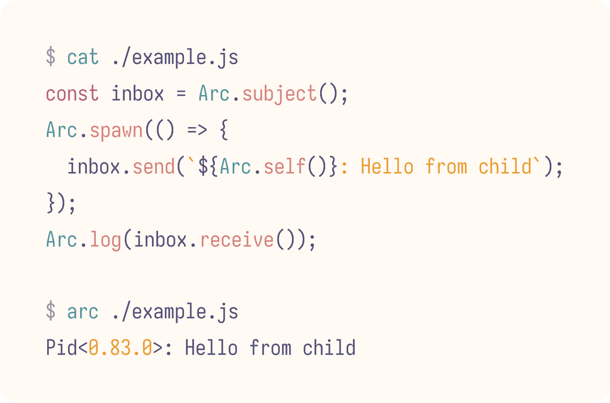
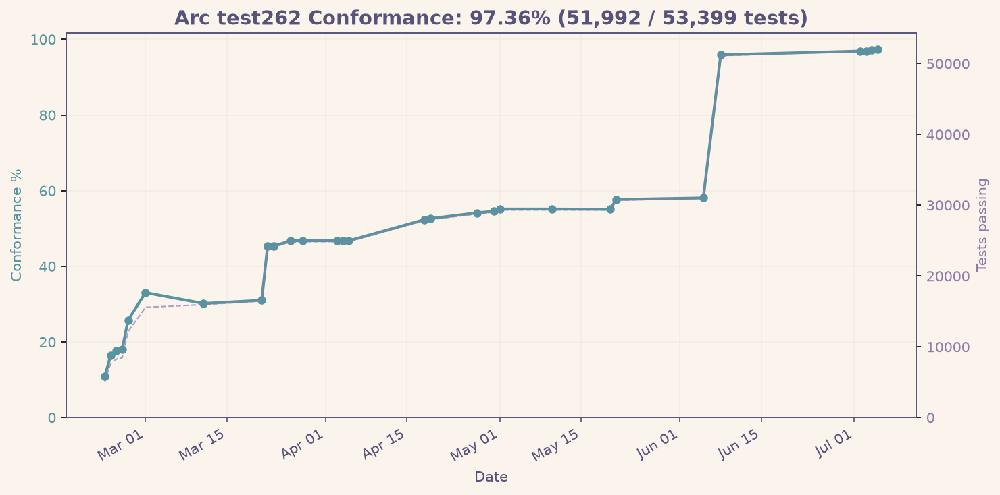

> [!NOTE]
> arc is still a young project, tread carefully!

# arc ⌒

JavaScript on the BEAM

<picture>
  <source media="(prefers-color-scheme: dark)" srcset="./.github/js.png">
  
</picture>
<br><br>

Arc is a JavaScript engine written in [Gleam](https://gleam.run) — the whole language, not a subset. It runs wherever the BEAM runs: on Erlang/OTP, and in the browser through [AtomVM](https://www.atomvm.net) compiled to WebAssembly.
<br><br>

It implements the language itself — closures, generators, async/await, classes, proxies, typed arrays, plus Intl and Temporal. The engine is small and host-agnostic: it knows nothing about the world outside ECMAScript. You embed it in a BEAM program and give it the globals and host functions you want — timers, I/O, a concurrency model — instead of inheriting a fixed runtime.
<br><br>

Tested against [test262](https://github.com/tc39/test262) on every commit:

<picture>
  <source media="(prefers-color-scheme: dark)" srcset=".github/test262/conformance-dark.png">
  
</picture>

---

```sh
gleam run -- file.js       # run a script
gleam test                 # unit tests
TEST262_EXEC=1 gleam test  # full test262 suite
TEST262=1 gleam test       # parser-only test262
```
