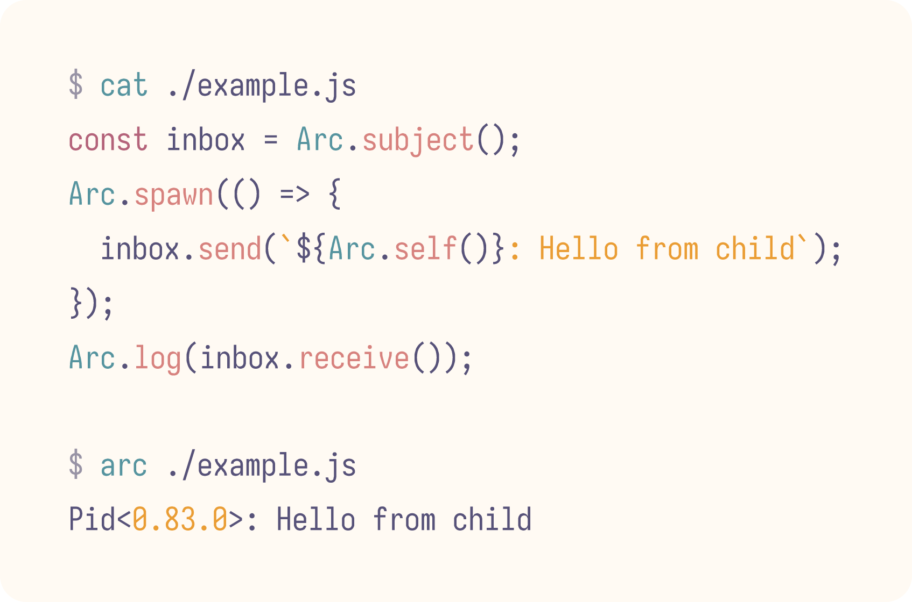
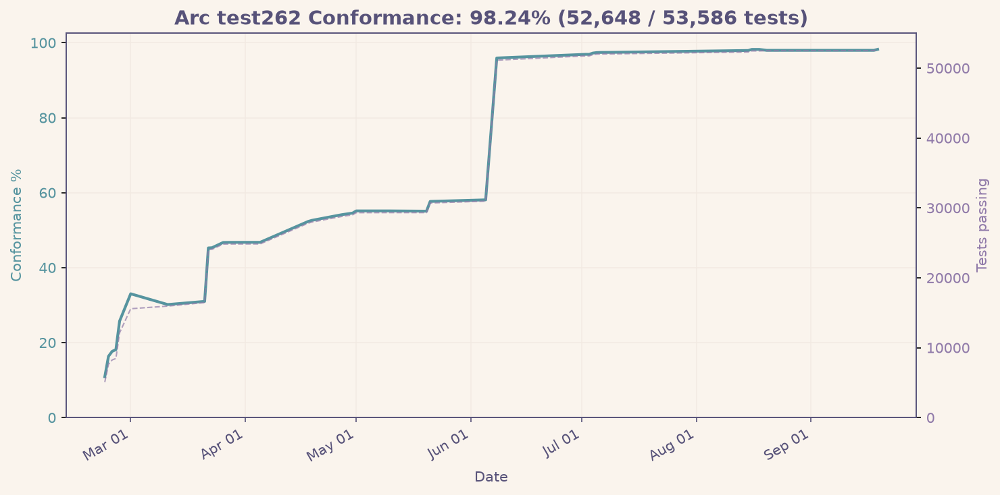

> [!NOTE]
> arc is still a young project, tread carefully!

# arc ⌒

JavaScript on the BEAM

<picture>
  <source media="(prefers-color-scheme: dark)" srcset="./.github/js.png">
  
</picture>
<br><br>

Arc is a JavaScript engine written in [Gleam](https://gleam.run). It implements ECMAScript, including closures, generators, async/await, classes, proxies, typed arrays, Intl and Temporal. You can run it on Erlang/OTP, or in the browser through [AtomVM](https://www.atomvm.net) compiled to WebAssembly.
<br><br>

Arc only provides what the ECMAScript spec defines, so it has no timers, I/O or concurrency built in. The BEAM program that embeds it chooses which globals and host functions the JavaScript can use.
<br><br>

Tested against [test262](https://github.com/tc39/test262) on every commit:

<picture>
  <source media="(prefers-color-scheme: dark)" srcset=".github/test262/conformance-dark.png">
  
</picture>

---

```sh
gleam run -- file.js       # run a script
gleam test                 # unit tests
TEST262_EXEC=1 gleam test  # full test262 suite
TEST262=1 gleam test       # parser-only test262
```
